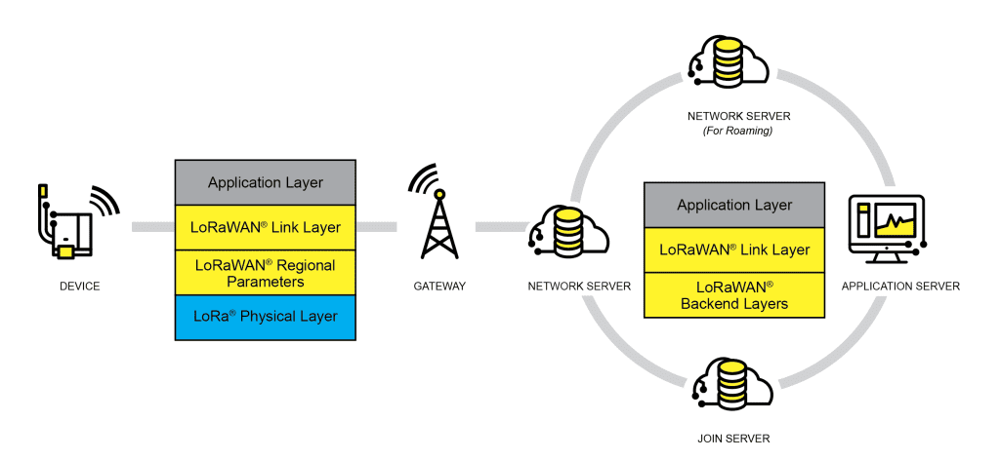
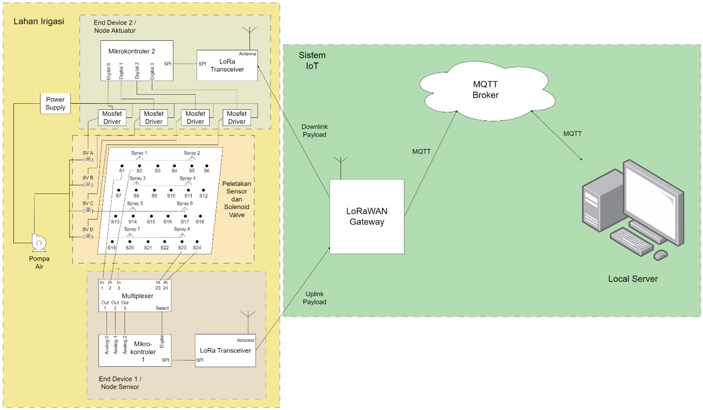
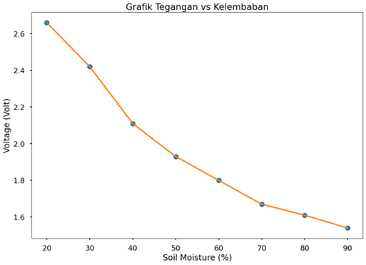
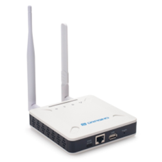
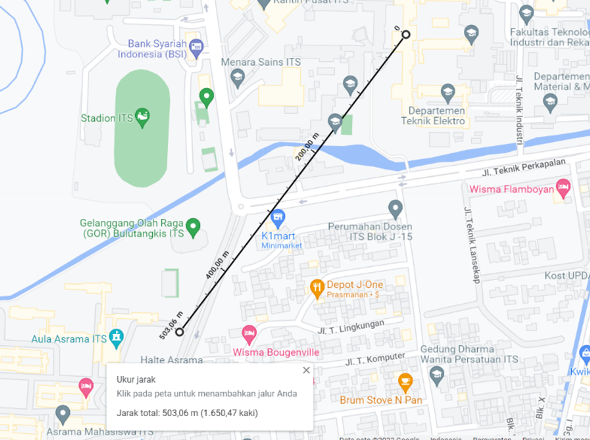

# IoT Smart Farming using LoRaWAN

I create a Smart Farming IoT device using the LoRaWAN network for my undergraduate thesis project. The system consists of some node sensors and a node actuator. Node sensor is a Lora device that reads an analog value from the soil moisture sensor and then sends the data via uplink messages. Node actuator is a Lora device that drives a solenoid valve based on the command via downlink messages. When the server detects dryness in some particular area, the server then sends a command to open the solenoid valve. If the solenoid valve is opened, the water can irrigate that area.

## LoRaWAN

The LoRaWAN® specification is a Low Power, Wide Area (LPWA) networking protocol designed to wirelessly connect battery operated ‘things’ to the internet in regional, national or global networks, and targets key Internet of Things (IoT) requirements such as bi-directional communication, end-to-end security, mobility and localization services. LoRaWAN® network architecture is deployed in a star-of-stars topology in which gateways relay messages between end-devices and a central network server. The gateways are connected to the network server via standard IP connections and act as a transparent bridge, simply converting RF packets to IP packets and vice versa. The wireless communication takes advantage of the **Lo**ng **Ra**nge characteristics of the LoRa physical layer, allowing a single-hop link between the end-device and one or many gateways. All modes are capable of bi-directional communication, and there is support for multicast addressing groups to make efficient use of spectrum during tasks such as Firmware Over-The-Air (FOTA) upgrades or other mass distribution messages.

LoRaWAN has three different classes of end-point devices to address the different needs reflected in the wide range of applications:

### Class A – Lowest power, bi-directional end-devices

The default class which must be supported by all LoRaWAN end-devices, class A communication is always initiated by the end-device and is fully asynchronous. Each uplink transmission can be sent at any time and is followed by two short downlink windows, giving the opportunity for bi-directional communication, or network control commands if needed.

### Class B – Bi-directional end-devices with deterministic downlink latency

In addition to the class A initiated receive windows, class B devices are synchronized to the network using periodic beacons, and open downlink ‘ping slots’ at scheduled times. This provides the network the ability to send downlink communications with a deterministic latency, but at the expense of some additional power consumption in the end-device. 

### Class C – Lowest latency, bi-directional end-devices

In addition to the class A structure of uplink followed by two downlink windows, class C further reduces latency on the downlink by keeping the receiver of the end-device open at all times that the device is not transmitting (half duplex). Based on this, the network server can initiate a downlink transmission at any time on the assumption that the end-device receiver is open, so no latency.

Security is a primary concern for any mass IoT deployment and the LoRaWAN® specification defines two layers of cryptography:

* A unique 128-bit Network Session Key shared between the end-device and network server
* A unique 128-bit Application Session Key (AppSKey) shared end-to-end at the application level

The keys can be Activated By Personalisation (ABP) on the production line or during commissioning, or can be Over-The-Air Activated (OTAA) in the field. OTAA allows devices to be re-keyed if necessary.

## System Design

The system consists of end devices placed on irrigation land, LoRaWAN gateway, MQTT broker, and server. Each part (end device, gateway, MQTT broker, and server) is connected. There are two end devices placed on the irrigation land to monitor soil moisture and control the solenoid valve for irrigation. According to observation results, there are 24 sensor placement points divided into 4 sectors. Each sector consists of 6 sensors and 1 solenoid valve. The gateway connects end devices with servers using the LoRaWAN network. The hardware used as a gateway is the Dragino LoRaWAN Gateway LPS8N. The server consists of an MQTT broker and a local Raspberry Pi server. The MQTT server is deployed on the Google Cloud platform. Data received from the MQTT broker is stored in a SQLite database and then processed using Python-based programming. The data is then visualized and displayed on a monitor screen connected to a mini PC using an HDMI cable. The mapping data is then used to determine priority sectors for irrigation. Based on this data, the local server sends a message to the MQTT broker in the form of a signal to turn on the solenoid valve. The MQTT broker then sends the message to the gateway, which is then forwarded to the end device via the LoRaWAN downlink payload.

## Sensor Characteristic

I use 2 types of capacitive soil moisture sensor, that is v1.0 and v1.2 from dfrobot. We must know the sensor characteristics to convert sensor analog voltage to soil moisture value. The test was carried out by reading the analog output voltage of the sensor on the analog pin of the Arduino microcontroller and the value of the soil moisture meter. The microcontroller reads the 10-bit digital value from the ADC (analog to digital converter). The 10-bit digital value is then converted into voltage in volts. The test is carried out by changing the soil moisture slowly. The soil is initially dry with the initial soil moisture reading on the soil moisture level tester being 20%. Then, water is poured slowly until the soil moisture reading is 90%. The reading scale for soil moisture level testers is in the range of 0-100%. The voltage value and ADC digital data were taken in 10 samples and then the average of each data was taken.

From the data obtained, it can be seen that the relationship between voltage and soil moisture and the ADC value and soil moisture is non-linear. Therefore, the relationship between voltage and soil moisture can be expressed in a polynomial function. The polynomial function is obtained by approximating the soil moisture function from the obtained set of parameters, in this case, voltage. The function approach is obtained using the polynomial regression method. The function is obtained by looking for a polynomial regression function of order 1 to order 5. From the polynomial regression function of order 1 to order 5, each function is compared for its error value, and the most optimal function is found.

### LoRaWAN Gateway

I use Dragino LPS8N LoRaWAN gateway. To connect the LoRa gateway and end device, several configurations need to be done on the LoRa gateway. Configuration includes connecting the LoRa gateway to the internet network via WiFi, configuring the frequency used, configuring ABP parameters, and configuring MQTT. Configuration is done via the web server on the gateway. To access the web server for the first time, the device used (laptop, computer, etc.) must be connected to the WiFi access point from the gateway.

### Signal Range Test Results

LoRa signal testing was carried out in an environment blocked by tall buildings. Testing was carried out by placing the LoRa gateway indoors. Meanwhile, end devices send LoRa payloads over different delivery distances. From the test results, it was found that the maximum distance for sending LoRa signals was 503 meters. Distance measurements were carried out using Google Maps.

## Source

* https://lora-alliance.org/about-lorawan/